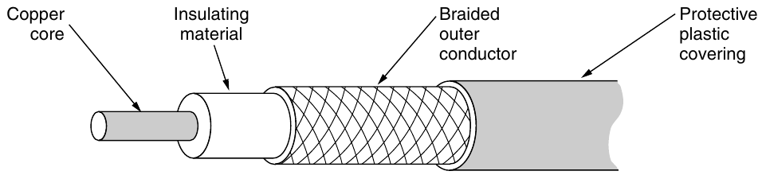
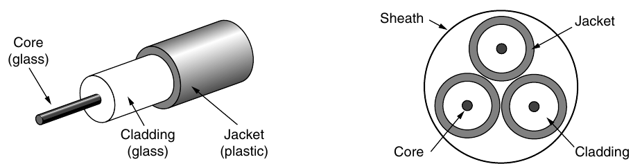
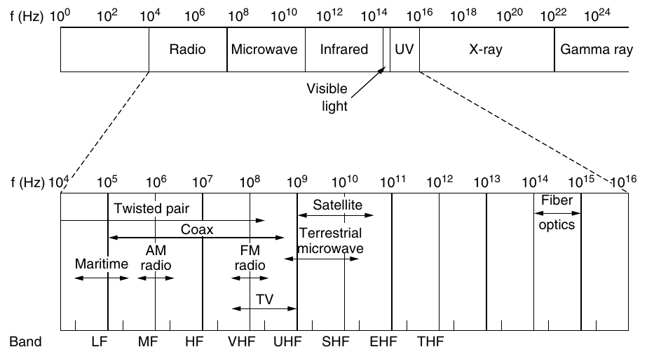
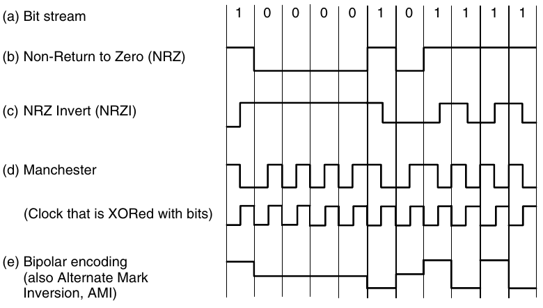
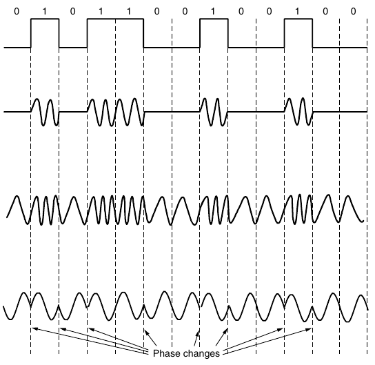
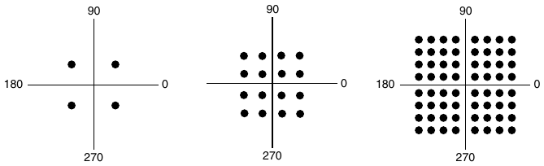
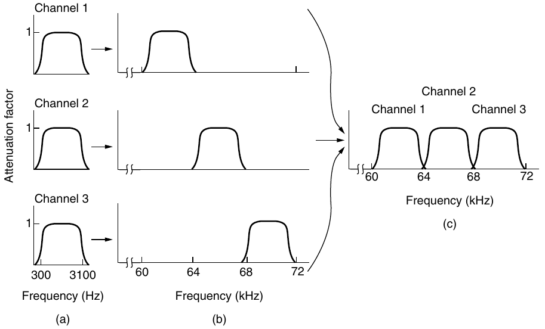

# Livello fisico

Si occupa di convertire i bit in segnali da trasmettere alle NIC.
Trasmette bit/segnali.

## Definizioni

### Bandwidth

(larghezza di banda) Quantità di informazioni che la sorgente riesce a trasferire alla destinazione.
_The width of the frequency range transmitted without being strongly attenuated._
In pratica, il _cutoff_ non è molto netto, quindi la bandwidth è dalla frequenza 0 alla frequnza attenuata la metà.

Nel cavo ethernet vengono utilizzate tutte le frequenze disponibili, partendo da 0 (**baseband**).
Nelle trasmissioni wireless invece la frequenza di partenza non è 0, ma parte dalla frequenza di competenza (es. 2.4GHz) (**passband**).

### Teorema di Nyquist

Maximum data rate; viene misurata in bit/s.
Henry **Nyquist**, un ingeniere dell'AT&T, nel 1924 ha scoperto che anche un mezzo di trasmissione perfetto ha un limite di trasmissione dati dovuto all'attenuazione del segnale.

$$
MDR \frac{bits}{sec}= 2 \times B \times \log_2 V
$$

- $B$ = bandwidth (Hz);
- $V$ = numero di simboli (valori discreti che si utilizzano per la trasmissione). (_es. $V=2 \Rightarrow 0V \leftrightarrow 5V$ ; $V=3 \Rightarrow 0V \leftrightarrow 3.3V \leftrightarrow 5V$_).


### Teorema di Shannon

**SNR**: _Signal-to-Noise Ratio_. Viene misurato in decibel (dB).

$$
SNR = 10 \log_{10} \frac{S}{N} \Leftrightarrow \frac{S}{N} = 10^{\frac{SNR}{10}}
$$

Il **teorema di Shannon**, a differenza del teorema di Nyquist, tiene conto del rumore presente nel canale di trasmissione.

$$
MDR \frac{bits}{sec} = B \times \log_2 (1 + \frac{S}{N})
$$

- $S$: Potenza del segnale;
- $N$: Potenza del rumore.

### Esercizi

#### 1

- $B = 3 kHz$
- $V = 2$

Essendo senza rumore si utilizza il teorema di Nyquist.

$$
MDR = 2 \times 3kHz \times \log_2 2 = 6 bps
$$

#### 2

- $B = 1 MHz$
- $SNR = 40 dB$

$$
\frac{S}{N} = 10^{\frac{40}{10}} = 10^4
$$

$$
MDR = 1 MHz \times \log_2 (1+10^4) \approx 13.3 Mbps
$$

#### 3

- $B = 6 MHz$
- $V = 4$

$$
MDR = 6 MHz \times \log_2 4 = 12 Mbps
$$

#### 4

- $B = 3kHz$
- $SNR = 20$

$$
\frac{S}{N} = 10^{\frac{20}{10}} = 10^2 = 100
$$

$$
MDR = 3kHz \times \log_2 (1+100) \approx 20
$$

# Trasmissione via cavo

## Twisted pairs

- Simplex: trasmissione in una direzione;
- Half-duplex: trasmissione in 2 direzioni, solo una direzione alla volta;
- Full-duplex: trasmissione in 2 direzioni contemporaneamente.

Alcuni cavi in Cat 6 possono trasmettere 500MHz in banda base e trasmettere a 10Gbps.

## Cavo coassiale



## Fibra ottica

A differenza degli altri mezzi visti finora, utilizza la luce per trasmettere i dati.

È necessaria un'interfaccia di conversione tra la luce e l'elettricità e viceversa (convertitore opto-elettronico).

La larghezza di banda teorica è circa 50Tbps, ma questa velocità non è raggiungibile perchè il convertitore perde del tempo nel convertire il segnale.



Il **core** deve essere abbastanza puro da non assorbire la luce che viene mantenuta al suo interno grazie alla differenza dell'_indice di rifrazione_ rispetto al **cladding**.

### Single-mode fiber

Creata specificatamente per un colore specifico ed è adatta alle lunghe distanze.
Può trasmettere fino a 100Gbps per 100km senza amplificazione.

### Multi-mode fiber

Può portare segnali di colore diverso, quindi permette una larghezza di banda maggiore.
Ha un'attenuazione maggiore ed è più economica, quindi non è adatta alle lunghe distanze.

### Come inviare il segnale

| Item                    | LED        | Semiconductor laser |
| ----------------------- | ---------- | ------------------- |
| Data rate               | Basso      | Alto                |
| Tipo di trasmissione    | Multi-mode | Multi o single mode |
| Distanza                | Corta      | Lunga               |
| Durata di vita          | Lunga      | Corta               |
| Temperature sensitivity | Minore     | Sostanziale         |
| Costo                   | Basso      | Alto                |

### Fibra ottica vs Rame

Vista il basso livello di attenuazione, la fibra ottica può percorrere distanze più lunghe (50km) con un data rate elevato.
Il rame invece ha una distanza massima di 5km, con massimo 15Mbps.

La fibra è anche più leggera: due fibre lunghe un chilometro sono più leggere (100kg) di mille twisted pairs di rame (8000kg).

# Trasmissione wireless

$$
c = \lambda \times f
$$



## Trasmissione radio (RF)

Il segnale trasmesso in uno spazio tridimensionale si disperde e diminuisce la sua potenza con il quadrato della distanza.

### AM

Le trasmissioni AM usa la banda MF (_medium frequency_), riescono ad attraversare edifici ma hanno una larghezza di banda bassa.

### HF

In alcuni casi è possibile utilizzare le onde HF (_high frequency_) per riflettere le onde radio sulla ionosfera per comunicare ad una distanza maggiore.

### Microonde

Sopra i 100MHz le onde riescono a essere concentrate (usando un'antenna parabolica) e quindi essere trasmesse in modo lineare, avendo un SNR maggiore.

Nel campo dei 4GHz l'acqua riesce ad assorbire il segnale, quindi la trasmissione è affetta da eventi meteorologici.

Le bande **ISM** (Industrial, Scientific, Medical) sono libere ma con l'obbligo di potenze basse.

## Trasmissione Infrarossa

Viene poco utilizzata perchè non passa attraverso le costruzioni ed è di bassa potenza

## Trasmissione Ottica

Avviene in linea d'aria e non deve essere ostruita da oggetti.

Anche se non sono presenti oggetti, l'aria può creare turbolenze e deviare il segnale.

## Comunicazioni Satellitari

Vengono utilizzate delle microonde.

Vengono chiamati **trasponder** i dispositivi che ricevono un segnale su una frequenza, lo elaborano e lo ritrasmettono su una frequenza diversa.

L'invio della trasmissione su una frequenza diversa dalla ricezione viene chiamato **bent pipe**.

Un satellite geostazionario si trova ad un'altezza da terra di poco meno di 36000km e il suo periodo di orbita è 24 ore.

Vengono utilizzate tre livelli di orbita:

- **LEO**: Low Earth Orbit <5000km (latenza: 270ms / Sat. necessari: 3);
- **MEO**: Medium Earth Orbit 5000-15000km (latenza: 35-85ms / Sat. necessari: 10);
- **Geostazionario** ~36000km (latenza: 1-7ms / Sat. necessari: 50).

Tra ogni livello sono presenti delle fasce chiamate **Fasce di Van Allen**, che creano molte interferenze date dalla presenza di particelle cariche.

I satelliti hanno una piccola quantità di carburante per eseguire operazioni di *station keeping*, ovvero piccole correzioni dell'orbita.

### Calcolo dell'orbita

$$
|F| = G \times \frac{M \times m}{r^2}
$$

$$
a_{fuga} = \frac{v^2}{r}
$$

$$
\omega = \frac{v}{r}
$$

$$
|a_{peta}| = \frac{|F|}{m} = \frac{G \times M}{r^2}
$$

Quando sono in equilibrio:

$$
|a_{fuga}| = |a_{peta}|
$$

Utilizzando i dati:

$$
G = 6.67 \times 10^{-11} \frac{Nm^2}{kg^2}
$$
$$
M = 5.972 \times 10^{24} kg
$$
$$
\omega = \frac{2\pi}{T} = \frac{6.28}{86400} = 7.27 \times 10^{-5} \frac{rad}{sec}
$$
$$
\frac{v^2}{r} = \frac{(\omega \times r)^2}{r} = \frac{\omega^2 \times r^2}{r} = \frac{G \times M}{r^2}
$$
$$
\omega^2 \times r^3 = G \times M \rightarrow r^3 = \frac{G \times M}{\omega^2}
$$
$$
r = \sqrt{\frac{G \times M}{\omega^2}} = 4.22 \times 10^{7} m
$$
$$
h = r - r_{terra} = 42200 - 6400 = 35800 km
$$

### Medium-Earth Orbit

Servono principalmente solo per il sistema GPS

### Low-Earth Orbit

Essendo molto vicini non richiedono molta potenza per la trasmissione di segnale.

I primi satelliti per la comunicazione telefonica furono creati dalla Motorola nel 1990.
Sui 77 satelliti pianificati, solo 66 furono lanciati.

# Modulazione digitale e Multiplexing

La modulazione digitale permette di inserire il segnale digitale in un segnale analogico e viceversa.
Il modem permette questa conversione.

Il multiplexing permette di condividere con più dispositivi lo stesso canale di trasmissione.

## Baseband Transmission



Per questo tipo di trasmissione è molto importante la sincronizzazione, quindi bisogna utilizzare un'altro canale per un clock.

### Bandwidth Efficiency

- Bit rate: numero di bit al secondo;
- Baud rate / Symbol rate: numeri di simboli al secondo.

Per trasmettere un segnale le due stazioni devono essere sincronizzate perfettamente.
Può essere utilizzato un segnale di clock esterno oppure per alcune codifiche è possibile derivarlo dal segnale stesso.
Le schede ethernet utilizzano la codifica *Manchester* per questo motivo.

L'USB invece utilizza l'*NRZI*, che dopo un certo numero di 0 trasmessi può portare a un dissincronismo.
Per obbiare a questo problema ogni gruppo di 4 bit viene trasmesso come gruppo di 5 bit in modo da non avere più di tre zeri consecutivi.

Un metodo alternativo è di utilizzare uno **scrambler**, il quale esegue una XOR con una sequenza di dati pseudo-random prima della trasmissione.

### Segnali bilanciati

Vengono definiti come i segnali che in un periodo breve hanno un valore medio uguale a 0, quindi non hanno una componente di corrente continua.

È meglio trasmettere un segnale bilanciato perchè la componente DC crea disturbi e spreca energia nella trasmissione.

Per un sistema più bilanciato è possibile usare una codifica 8b/10b al posto di una 4b/5b, avendo un numero di 0 molto simile al numero di 1.

## Passband transmission

Per trasmettere un segnale bisogna "shiftarlo" di una frequenza $S$ da $0 \leftrightarrow B$ \[Hz\] a $S \leftrightarrow (S+B)$ \[Hz\].

Esistono vari metodi per raggiungere questo obiettivo:

- **ASK**: *(Amplitude Shift Keying)*
- **FSK**: *(Frequency Shift Keying)*
- **PSK**: *(Phase Shift Keying)*

$$
f(t) = A \times \sin(\omega t + \varphi) = A \times \sin(\frac{2\pi}{T} t + \varphi)
$$

Cambiando i valori di ampiezza ($A$), frequenza ($\omega$) o fase ($\varphi$) è possibile trasmettere un segnale variabile.



### Quadrature Phase Shift Keying

**Constellation diagram**



Nell'immagine:
1. *QPSK*
2. *QAM-16*
3. *QAM-64*

Con QPSK (QAM-4) è possibile inviare 4 simboli, al posto di 2, cambiando la fase ($\varphi$) di $\frac{\pi}{4}\times k$.
Utilizzando QAM-16 o QAM-64 vengono usati rispettivamente 16 e 64 simboli, e viene variata la fase ($\varphi$) e l'ampiezza ($A$).

È possibile che il segnale sia completamente sovrastato dal rumore (_ablazione_).

## Multiplexing

### Time Division Multiplexing

Il canale viene assegnato ad ogni _stream_ per un periodo di tempo ciascuno. (_round-robin_).

#### Statistical Time Division Multiplexing

Il tempo assegnato ad ogni stream non è fisso, ma dipende dall'utilizzo di quello stream.

### Frequency Division Multiplexing

Il canale viene diviso in multipli sottocanali, il che divide la banda totale, ma permette una comunicazione senza aspettare il proprio _slot_.



- **a**: Banda originale;
- **b**: Banda shiftata di frequenza;
- **c**: Canale multiplexed.

### Code Division Multiplexing

Si suddivide un bit in $m$ intervalli chiamati _chips_.
Normalmente ci sono 64 o 128 chips per bit.

Per esempio per inviare 1 bit e con $m = 8$, bisogna inviare \[-1, -1, -1, +1, +1, -1, +1, +1\] e per 0 bit \[+1, +1, +1, -1, -1, +1, -1, -1\] (uno l'inverso dell'altro).

È quindi possibile utilizzare un canale trasmettendo più "bit" (formati da chips diversi) contemporaneamente.

È un canale a tre livelli perchè può anche essere inviato niente.

Viene anche comunemente chiamato **CDMA** (Code Division Multiplexing Access)

Prodotto scalare:
$$
\mathbf{S \bullet T} \equiv \frac{1}{m} \sum^{m}_{i=1} S_i T_i
$$

```py
def prodottoScalare(S, T):
	'''
	S e T stessa dimensione
	'''
	somma = 0
	i = 0
	while i<len(S):
		somma = somma + S[i] * T[i]
		i += 1
	prod = somma/len(S)
	return prod
```

Se il prodotto scalare è $0$ ($\mathbf{S} \perp \mathbf{T}$), i vettori si dicono ortogonali, e quindi non si disturbano a vicenda.

$$
\mathbf{S \bullet T} = \frac{1}{m} \sum^{m}_{i=1} S_i T_i =\frac{1}{m} \sum^{m}_{i=1} S^2 = \frac{1}{m} \sum^ {m}_{i=1} (-1)^2
$$

#### Esempio

- B = (+1,+1,+1,+1) -> 1
- !B = (-1,-1,-1,-1) -> 0

$$
\mathbf{B \bullet B} = \frac{1}{4} \sum^{4}_{i=1} B_i B_i = \frac{1}{4}\times(1+1+1+1) = 1
$$

$$
\mathbf{\overline B \bullet \overline B} = \frac{1}{4} \sum^{4}_{i=1} B_i B_i = \frac{1}{4}\times(1+1+1+1) = 1
$$

$$
\mathbf{B \bullet \overline B} = \frac{1}{4} \sum^{4}_{i=1} B_i \overline{B_i} = \frac{1}{4}\times(-1-1-1-1) = -1
$$

- S = (+1,+1,+1,-1) -> 1

$$
\mathbf{B \bullet S} = \frac{1}{4} \sum^{4}_{i=1} B_i S_i = \frac{1}{4}\times(1+1+1-1) = \frac{1}{2}
$$

B manda 1 e S manda 1, viene ricevuto 2 per i primi tre chips e 0 per l'ultimo.
Sapendo le sequenze utilizzate da B ed S, è possibile ricavare i bit trasmessi da B ed S.

Per trovare i bit trasmessi basta fare il prodotto scalare tra il segnale ricevuto e la sequenza di chips per ogni stazione.

# Tecnologie telefoni fissi

## PSTN (Public Switched Telephone Network)

Rete utilizzata per i telefoni fissi.

Essa è cambiata nel tempo:

1. Inizialmente tutti i nodi (telefoni) erano interconnessi tra di loro;
2. Dopodichè si è utilizzato una configurazione a "stella", nel quale tutti i telefoni sono collegati ad un nodo centrale;
3. Ora esistono centraline di primo livello e centraline intermedie, rendendo la rete rindondante ma con meno cavi.

### Definizioni

- **Local loop**: Ultimo collegamento tra la centralina periferica (_end office_) e il telefono.

- **End office**: Prima centralina connessa ai telefoni fissi.

- **Toll office**: Centralina connessa tra lo switching office e l'end office (si occupa di tenere il conto della tariffa della telefonata).

- **Point Of Presence**: Punto usato dall'ISP per fornire un collegamento internet tramite linea telefonica.

- **Local number portability**: Mantenere lo stesso numero di telefono anche con un cambio di operatore.

## DSL (Digital Subscriber Lines)

Tecnologia successiva al _PSTN_.

L'SNR e quindi la velocità dipendono dalla distanza da casa all'end office.

La banda totale (1.1MHz) viene divisa in 256 canali indipendenti (circa 4kHz ciascuno).

I primi 25 canali non vengono usati e vengono lasciati per la voce.
Dopodichè nell'_ADSL_ vengono divisi in modo non simmetrico i canali per l'upstream e per il downstream.

Associato ad ogni canale c'è un modem.
Viene usato un DSP (digital signal processor) per analizzare il segnale.

## Switching

**Switching**: Collegamento tra due dispositivi.

Esistono due tipologie di switching:

- **Circuit Switching**: Collegamento fisico tra i due dispositivi;
- **Packet Switching**: I pacchetti vengono reindirizzati in una rete da un dispositivo all'altro.

# Comunicazione cellulare

- **1G**: Voce analogica;
- **2G**: Voce digitale;
- **3G**: Voce digitale e dati;

