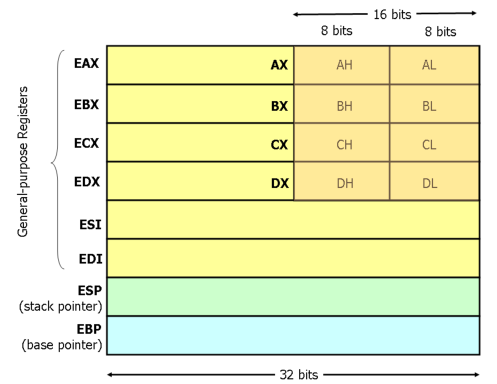

# I registri

I registri si dividono in general purpose o special purpose.

## General purpose

I moderni processori x86 possiedono 8 registri da 32-bit general puprose.



Sono:

- `EAX`;
- `EBX`;
- `ECX`;
- `EDX`;
- `ESI` (source index);
- `EDI` (destination index).

## Special purpose

I registri special purpose si dividono in registri di segmento e altri

### Registri di segmento

Sono:

- `ECS` (code segment);
- `EDS` (data segment);
- `ES`  (extra segment);
- `SS`  (stack segment): indirizzo del segmento e offset top dello stack.

### Altri

Sono:

- `EIP`/`PC` (instruction pointer/program counter): contiene l'indirizzo della prossima istruzione che il processore deve eseguire;
- `ESP` (stack pointer);
- `EBP` (base pointer);
- `IR` (instruction register);
- `MAR` (memory address register);
- `MDR` (memory data register);
- ...

## Le cache

Le cache sono memorie molto veloci e si dividono in 3 livelli.
Le cache si possono inoltre distinguere se sono uniche o sono divise per dati e istruzioni.

Solo la cache L1 è fisicamente nel processore.

## Altri componenti

Sono:

- `MMU` (memory management unit): si occupa di gestire la memoria;
- `BUI` (bus unit interface): gestisce il bus;
- `ALU` (arithmetic and logic unit): si occupa di eseguire operazioni aritmetiche;
- `FPU` (floating point unit): esegue operazioni con i numeri a virgola mobile;
- `DU` (decoding unit): decodifica le istruzioni (tipo aritmetico, spostamento di valori, ...);
- `EU` (execution unit): esegue le istruzioni.

## Modalità di operazione

Un processore ha due modalità distinte per eseguire le operazioni:

- Modalità kernel;
- Modalità User.

Se l’istruzione viene eseguita se un processore in modalità kernel, essa può eseguire qualunque cosa senza nessun limite.
Se il processore si trova in modalità user, alcune operazioni dell’insieme di istruzioni non sono eseguibili perché non è autorizzato a farlo.

Nel registro `PSW` (registro dei flag) c’è un bit che indica in quale modalità il microprocessore è in esecuzione.

Un processo per passare dalla modalità User alla modalità Kernel deve eseguire una chiamata al sistema operativo. Questa istruzione viene chiamata `system call` o `TRAP`.

# Dichiarazione variabili

La dichiarazione di variabili statiche deve essere preceduta da `.DATA` e per dichiararle vengono utilizzate le istruzioni:

- `DB` per 1 byte (Declare Byte)
- `DW` per 2 byte (Declare Word)
- `DD` per 4 byte (Declare Double word)

## Sintassi

```nasm
.DATA

var  DB 64  ;dichiara una variabile grande un byte all'indirizzo var
            ;   e assegna il valore 64.

var2 DW ?   ;dichiara una variabile grande due byte all'indirizzo var2
            ;   ma non assegna nessun valore.

     DB 10  ;dichiara una variabile grande un byte senza nome,
            ;   all'indirizzo var2+1 e assegna il valore 10.
```

## Array

Differentemente dai linguaggi ad alto livello, gli array sono solo celle di memoria contigue.
Per dichiarare un array si possono elencare i vari valori, utilizzare l'istruzione `DUP` o delle stringhe.
L'istruzione `DUP` ripete un valore per un determinato numero di volte: `4 DUP(2)` è uguale a `2, 2, 2, 2`.

### Esempi

```nasm
.DATA

Z       DD 1, 2, 3      ;dichiara 3 variabili da 4 byte ciascuna,
                        ;   le inizializza con 1, 2 e 3 rispettivamente.
                        ;   Il valore di Z+8 sarà 3.

bytes   DB 10 DUP(?)    ;dichiara 10 variabili non inizializzate partendo
                        ;   dall'indirizzo bytes.

arr     DD 100 DUP(0)   ;dichiara 100 variabile inizializzate a 100 grandi
                        ;   4 byte ciascuna, partendo dall'indirizzo arr.

str     DB 'hello',0    ;dichiara 6 byte contenenti ciascuno il codice
                        ;   ASCII della lettera corrispondente e uno 0.
```

# Istruzioni di movimento dati

## MOV

I processori x86 possono indirizzare fino a $2^{32}$ byte di memoria
Oltre a supportare gli indirizzamenti tramite nomi delle variabili, è possibile sommare fino a 2 registri (32-bit) con una costante (signed 32-bit).
Un registro può essere inoltre moltiplicato per 2, 4 o 8.

Per copiare variabili viene utilizzata l'istruzione `MOV`.

### Sintassi

I parametri possibili sono:

- `mov <reg>,<reg>`
- `mov <reg>,<mem>`
- `mov <mem>,<reg>`
- `mov <reg>,<const>`
- `mov <mem>,<const>`

### Esempi

```nasm
MOV EAX, [EBX]          ;copia i 4 byte in memoria all'indirizzo
                        ;   contenuto in EBX in EAX.

MOV [var], EBX          ;copia i il contenuto di EBX nello spazio di
                        ;   memoria all'indirizzo var grande 4 byte.

MOV EAX, [ESI-4]        ;copia i 4 byte in memoria all'indirizzo
                        ;   contenuto in ESI+(-4) in EAX.

MOV [ESI+EAX], CL       ;copia il contenuto di CL all'indirizzo di
                        ;   memoria ESI+EAX.

MOV EDX, [ESI+4*EBX]    ;copia i 4 byte in memoria all'indirizzo
                        ;   ESI+(4*EBX) in EDX.
```

Alcune sintassi invalide:

```nasm
MOV EAX, [EBX-ECX]      ;si possono solo sommare due registri.

MOV [EAX+ESI+EDI], EBX  ;si possono sommare massimo due registri.
```

### Specificare la grandezza

Per specificare la grandezza dei valori da copiare nel caso ci siano ambiguità è necessario usare:

- `BYTE PTR`
- `WORD PTR`
- `DWORD PTR`

#### Esempi

```nasm
MOV BYTE PTR [EBX], 2   ;copia 2 in un singolo byte all'indirizzo in EBX.

MOV WORD PTR [EBX], 2   ;copia la rappresentazione a 16-bit di 2 in
                        ;   2 byte partendo dall'indirizzo in EBX.

MOV DWORD PTR [EBX], 2  ;copia la rappresentazione a 32-bit di 2 in
                        ;   4 byte partendo dall'indirizzo in EBX.
```

## PUSH

L'istruzione `PUSH` copia i suoi parametri in cima allo stack in memoria.

Azioni eseguite da `PUSH`:

- decrementa `ESP` di 4
- copia il suo argomento all'indirizzo `[ESP]`

`ESP` è lo stack pointer e contiene l'indirizzo di memoria dell'ultimo valore nello stack.
Lo stack pointer viene decrementato perchè lo stack cresce verso il basso: dall'indirizzo più grande a quello più piccolo.

### Sintassi

I parametri possibili sono:

- `PUSH <reg32>`
- `PUSH <mem>`
- `PUSH <con32>`

### Esempi

```nasm
PUSH EAX    ;aggiunge EAX allo stack.

PUSH [var]  ;aggiunge il valore contenuto di 4 byte all'indirizzo
            ;   var allo stack.
```


## POP

L'istruzione `POP` muove il valore in cima allo stack in memoria in una variabile o registro.

Azioni eseguite da `POP`:

- copia il valore all'indirizzo `[ESP]` nel suo argomento
- incrementa `ESP` di 4

### Sintassi

I parametri possibili sono:

- `POP <reg32>`
- `POP <mem>`

### Esempi

```nasm
POP EDI     ;rimuove l'ultimo valore dello stack e lo copia in EDI.

POP [EBX]   ;rimuove l'ultimo valore dello stack e lo copia in memoria
            ;   all'indirizzo in EBX.
```


## LEA

L'istruzione `LEA` copia l'indirizzo di una variabile in memoria in un registro.

### Sintassi

I parametri possibili sono:

- `LEA <reg32>, <mem>`

### Esempi

```nasm
LEA EDI, [EBX+4*ESI]    ;l'indirizzo della variabile all'indirizzo
                        ;   EBX+4*ESI viene copiato in EDI

LEA EAX, [var]          ;l'indirizzo della variabile var viene copiato in EAX
```

### Differenze con MOV

Poniamo questa situazione:

Registri:

| Registro | Valore     |
| -------- | ---------- |
| EAX      | 0x00000000 |
| EBX      | 0x00403A40 |

Memoria:

| Indirizzo  | Valore     |
| ---------- | ---------- |
| 0x00403A40 | 0x7C81776F |
| 0x00403A44 | 0x7C911000 |
| 0x00403A48 | 0x0012C140 |
| 0x00403A4C | 0x7FFDB000 |

Programma:

```nasm
LEA EAX, [EBX+8]    ;EAX conterrà 0x00403A48

MOV EAX, [EBX+8]    ;EAX conterrà 0x0012C140
```


# Istruzioni aritmetiche e logiche

## ADD

L'istruzione `ADD` somma i 2 operandi e scrive il risultato nel primo operando.

Equivale al `+=` di C.

### Sintassi

I parametri possibili sono:

- `add <reg>, <reg>`
- `add <reg>, <mem>`
- `add <mem>, <reg>`
- `add <reg>, <con>`
- `add <mem>, <con>`

### Esempi
```nasm
add EAX, 10             ;EAX = EAX + 10

add BYTE PTR [var], 10  ;aggiunge 10 al byte var in memoria
```

## SUB

L'istruzione `SUB` sottrae i 2 operandi e scrive il risultato nel primo operando.

Equivale al `-=` di C.

### Sintassi

I parametri possibili sono:

- `sub <reg>, <reg>`
- `sub <reg>, <mem>`
- `sub <mem>, <reg>`
- `sub <reg>, <con>`
- `sub <mem>, <con>`

### Esempi

```nasm
sub AL, AH      ;AL = AL - AH

add EAX, 216    ;sottrae 216 da EAX
```

## INC/DEC

L'istruzione `INC` incrementa l'operando di 1.
L'istruzione `DEC` decrementa l'operando di 1.

Equivale al `++`/`--` di C.

### Sintassi

I parametri possibili sono:

- `inc <reg>`
- `inc <mem>`
- `dec <reg>`
- `dec <mem>`

### Esempi

```nasm
dec EAX             ;EAX = EAX + 10

inc DWORD PTR [var] ;aggiunge 10 al byte var in memoria
```

## IMUL

L'istruzione `IMUL` ha 2 modalità di operazione:

- Con 2 operandi, essi vengono moltiplicati e scritti nel primo;
- Con 3 operandi, il secondo e il terzo vengono moltiplicati e il prodotto viene scritto nel primo.

### Sintassi

I parametri possibili sono:

- `imul <reg32>, <reg32>`
- `imul <reg32>, <mem>`
- `imul <reg32>, <reg32>, <con>`
- `imul <reg32>, <mem>, <con>`

### Esempi

```nasm
imul EAX, [var]     ;EAX = EAX * var

imul ESI, EDI, 25   ;ESI = EDI * 25
```


## IDIV

L'istruzione IDIV divide i 64 bit contenuti in `EDX:EAX` l'operando datogli e restituisce:

- In `EAX` il risultato della divisione;

- In `EDX` il resto della divisione.

### Sintassi

I parametri possibili sono:

- `idiv <reg32>`
- `idiv <mem>`

### Esempi

```nasm
idiv EBX	;EAX = EDX:EAX / EBX
			;EDX = EDX:EAX % EBX
```


# Istruzioni per il controllo del flusso

## label

Si possono utilizzare delle etichette per identificare un'istruzione univoca.

### Esempi

```nasm
begin: mov EAX, [ESI]
```

## JMP

L'istruzione `JMP` (_jump_) permette di saltare ad una istruzione tramite la sua etichetta.

### Sintassi

I parametri possibili sono:

- `jmp <label>`

### Esempi

```nasm
jmp begin
```

## CMP

L'istruzione `CMP` compara i due valori, viene utilizzata prima di una jump condizionata.

### Sintassi

I parametri possibili sono:

- `cmp <reg32>, <reg32>`
- `cmp <reg32>, <mem>`
- `cmp <mem>, <reg32>`
- `cmp <reg32>, <con>`

### Esempi

```nasm
cmp EAX, [var]
```

## jump condizionata

Queste istruzioni vengono utilizzate dopo `CMP` e saltano ad un etichetta se la condizione è verificata.

### Sintassi

- je <label> (jump when equal)
- jne <label> (jump when not equal)
- jz <label> (jump when last result was zero)
- jg <label> (jump when greater than)
- jge <label> (jump when greater than or equal to)
- jl <label> (jump when less than)
- jle <label> (jump when less than or equal to)

### Esempi

```nasm
cmp EAX, EBX
jle begin
```

# Appunti personali

## Vettori

I vettori vengono chiamati buffer.
Vengono definiti come blocchi di memoria (senza spazi in mezzo).

Assembly considera ogni elemento come un byte (dimensione cella di memoria).
Spiazzamento = distanza di un elemento dall'inizio del buffer.
È necessario sapere dove inizia il buffer e quale elemenot bisogna accedere.

Se il buffer inizia all'indirizzo 435 e ci interessa trovare l'indirizzo del 23 elemento, è necessario fare: 435+23.

Se la grandezza dell'elemento è di 4 byte, bisogna moltiplicare il suo indice per 4: 43+(23*4).

Fare riferimento alla sezione dichiarazione variabili sopracitata.

Base del buffer = inizio del buffer.
Per ottenerla:
```nasm
lea [vettore]
```

#### Tipo di un vettore

esempio

```c
#include <stdio.h>
int v[10];

int main()
{
	v[0] = 0;
	printf("%i %i %i %i\n", v, &v[0], &v[1], &v[2]);
}
```

L'indirizzo di memoria del vettore equivale all'indirizzo del primo elemento.

Il tipo di `v` è `int *`.
